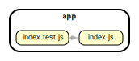

# Node Starter

## TLDR

Use of this starter template assumes that you have a 'complete dev environment' setup - a terminal, Node, VS Code, at least. If not, you may want to [start here.](https://www.notion.so/codefinity/Setting-up-a-Local-Dev-Environment-for-JS-02a4e9f4a30043d3a8e7d109be3448f4)

1. Click that big green button to start using it.
2. `clone` your new repo from your GitHub to your local computer
3. `cd` into the `clone`d repo and enter: `npm i`.
4. `npm start`

## Some of What's Included

- 
- Various VS Code 'settings' and 'extensions.' Look in the bottom right when you open this up in VS Code to install them.
- [Vitest](https://vitest.dev/) for testing. Just do `npm test` or `npm t`.

## Dependency Graph

This project includes "dependency-cruiser". You can generate a dependency graph by running npm run dep-graph. This will be in SVG format by default. You can change this in the package.json file.

Note: You must have Graphviz installed for this to work. You can install it using Homebrew on macOS with brew install graphviz.

Here's an example of what the dependency graph looks like:

## How To Use

Run `npm i` to get all the things installed.

`npm start` will watch the `app` directory for any changes using `nodemon`

## Other Notes

To use the new experimental `fetch` that's now in Node, just add: `/* global fetch */` to the top of your file. This will appease ESLint.
